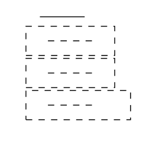

# The issue

This repository demonstrates a strange behavior of `LaTeX`. It contains two
`.tex` files: `pic.tex` and `main.tex`. `pic.tex` is a document which uses the
`standalone` class to only render TikZ code. This code produces a pdf with a
line. `main.tex` includes `pic.pdf` via `\includegraphics{pic.pdf}` four times:

* as `\includegraphics{pic.pdf}`,
* as `\node[draw, dashed] {\includegraphics{pic.pdf}}`,
* as `\node[draw, dashed] {\mbox{\includegraphics{pic.pdf}}}`, and
* as `\node[draw, dashed] {\parbox{...}{\includegraphics{pic.pdf}}}`.

For the latter three the TikZ style of the node changes the behavior of the
included *pdf file*; i.e., we obtain:

We provide a [`Makefile`](./Makefile) to reproduce the issue. `pdflatex` needs
to be available. Also we require the packages `tikz` and `graphicx`.
